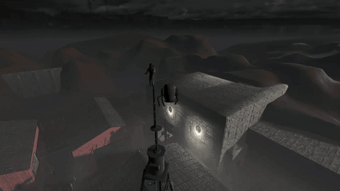
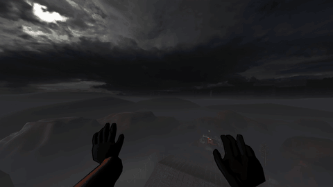
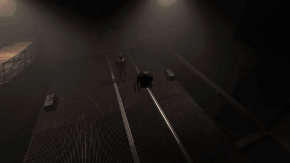
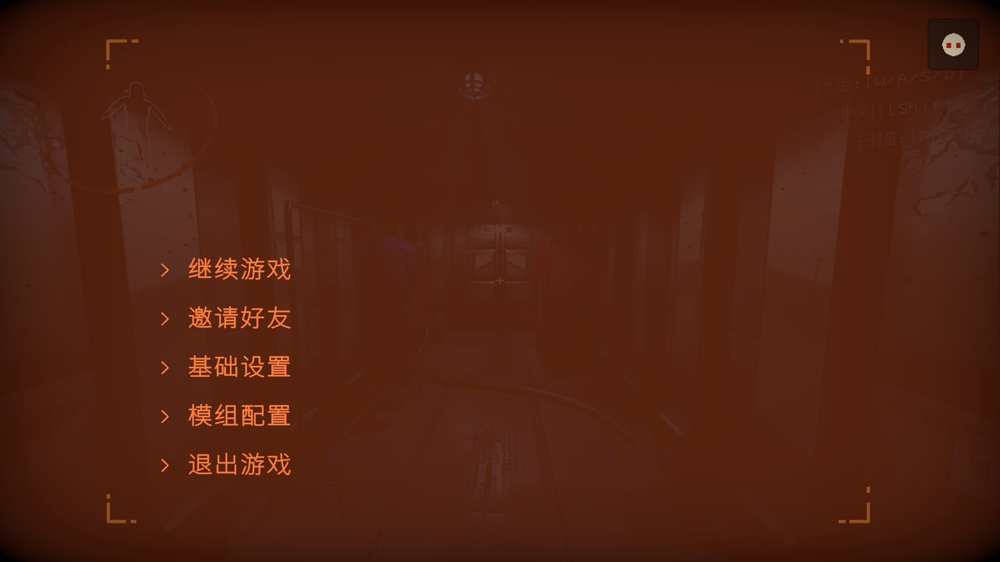
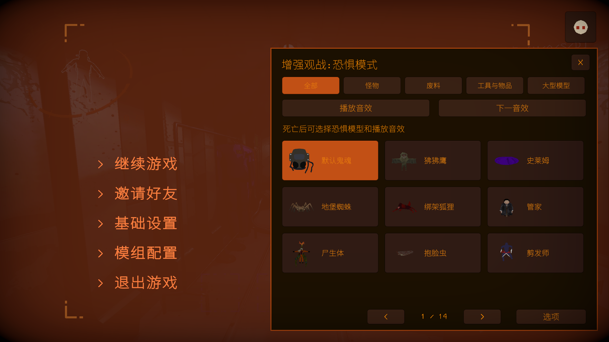
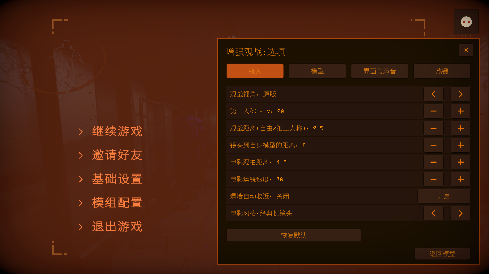
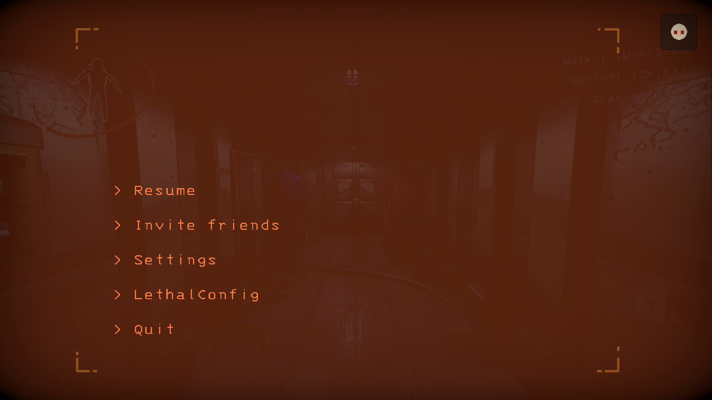
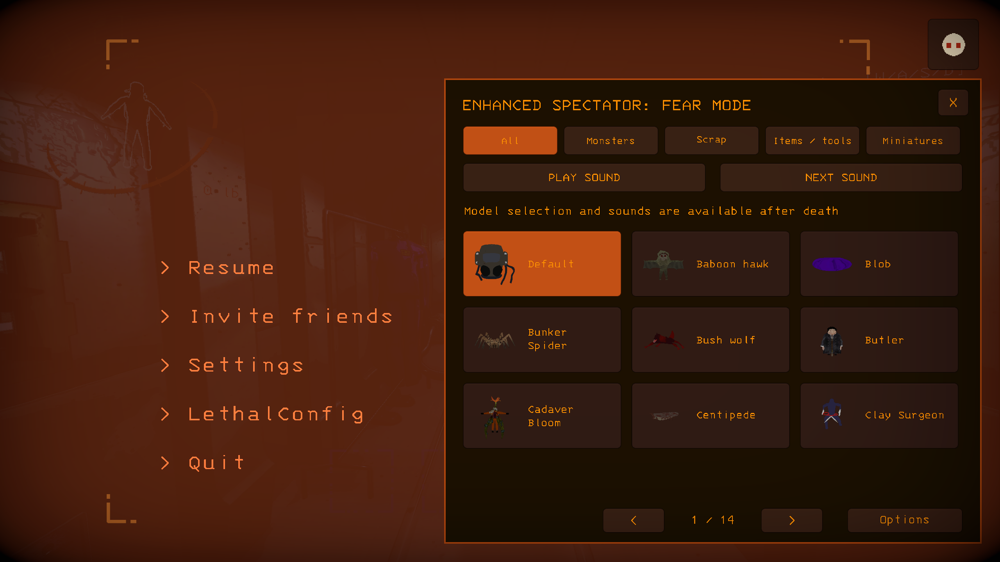
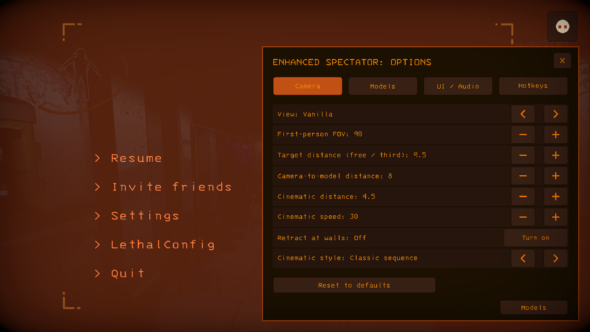

<h1 align="center">Enhanced Spectator</h1>

  
  
  
  

  
  
  

<strong>中文</strong>

### 观战系统

<table>
  <tr>
    <td width="50%" align="center"> 自身第三人称</td>
    <td width="50%" align="center"> 队友第一人称</td>
  </tr>
  <tr>
    <td colspan="2" align="center"> 第三人称恐惧模型</td>
  </tr>
</table>

### ESC菜单

<table>
  <tr>
    <td width="50%" align="center"> ① ESC 菜单右上角入口</td>
    <td width="50%" align="center"> ② 分类选择模型与音效</td>
  </tr>
  <tr>
    <td colspan="2" align="center"> ③ 在选项中调整镜头、模型、声音和热键</td>
  </tr>
</table>

### 默认操作

| 操作 | 按键 |
|:--|:--|
| 自由视角 / 返回原版 | `F6` / `F7` |
| 自身第三人称 / 队友第一人称 / 电影跟拍 | `F3` / `F4` / `F5` |
| 移动 / 上升 / 下降 | `W A S D` / `Space` / `Left Ctrl` |
| 加速 / 减速 / 回正位置 | `Left Shift` / `Left Alt` / `R` |
| 观战距离 / 第三人称镜头到自身模型的距离 | 滚轮 / `Alt＋滚轮` |
| 上一模型 / 下一模型；电影模式切换运镜风格 | `←` / `→` |
| 播放或停止音效 / 下一音效 | `Z` / `X` |
| 显示按键提示 / 隐藏观战界面 | `H` / `F2` |

### 安装

通过 **r2modman / Thunderstore Mod Manager** 安装已发布版本，或将 `EnhancedSpectator.dll` 放入 `BepInEx/plugins/EnhancedSpectator/`，需要 **BepInExPack 5.4.2100**。

配置保存在 `BepInEx/config/Auuueser.EnhancedSpectator.cfg`，高级设置位于同名 `.Advanced.cfg` 文件。

### 兼容

- **MoreCompany**：第一人称观战时隐藏遮挡镜头的装饰。
- **LCBetterClock**：观战名称避让时钟。
- **LC Chinese Project**：自动切换中文界面与配置，支持玩家名称修复。

遇到问题请在 [Issues](https://github.com/Auuueser/Enhanced-Spectator/issues) 附上复现步骤、模组列表及 `BepInEx/LogOutput.log`。项目采用 [GPL-3.0](https://github.com/Auuueser/Enhanced-Spectator/blob/main/LICENSE) 许可。

<strong>English</strong>

### Spectator System

<table>
  <tr>
    <td width="50%" align="center"> Self third person</td>
    <td width="50%" align="center"> Teammate first person</td>
  </tr>
  <tr>
    <td colspan="2" align="center"> Third-person fear models</td>
  </tr>
</table>

### ESC menu

<table>
  <tr>
    <td width="50%" align="center"> ① Open the top-right ESC menu entry</td>
    <td width="50%" align="center"> ② Browse models and sounds by category</td>
  </tr>
  <tr>
    <td colspan="2" align="center"> ③ Adjust cameras, models, audio and hotkeys in Options</td>
  </tr>
</table>

### Default controls

| Action | Key |
|:--|:--|
| Freecam / return to vanilla | `F6` / `F7` |
| Self third person / teammate first person / cinematic tracking | `F3` / `F4` / `F5` |
| Move / ascend / descend | `W A S D` / `Space` / `Left Ctrl` |
| Fast / slow / recenter | `Left Shift` / `Left Alt` / `R` |
| Spectator distance / third-person camera-to-model distance | Scroll wheel / `Alt + wheel` |
| Previous / next model; switch camera styles in cinematic mode | `Left` / `Right` |
| Play or stop sound / next sound | `Z` / `X` |
| Toggle key hints / hide spectator HUD | `H` / `F2` |

### Installation

Install a published version through **r2modman / Thunderstore Mod Manager**, or place `EnhancedSpectator.dll` in `BepInEx/plugins/EnhancedSpectator/`. Requires **BepInExPack 5.4.2100**.

Settings are saved to `BepInEx/config/Auuueser.EnhancedSpectator.cfg`; advanced settings use the matching `.Advanced.cfg` file.

### Compatibility

- **MoreCompany:** hides obstructing cosmetics during first-person spectating.
- **LCBetterClock:** keeps the spectator name clear of the clock.
- **LC Chinese Project:** automatically selects Chinese UI and configuration, with player-name repair available.

Report problems through [Issues](https://github.com/Auuueser/Enhanced-Spectator/issues), including reproduction steps, your mod list and `BepInEx/LogOutput.log`. Licensed under [GPL-3.0](https://github.com/Auuueser/Enhanced-Spectator/blob/main/LICENSE).

