<h1 align="center">Enhanced Spectator</h1>

  
  
  
  

  
  
  

<strong>中文</strong>

### 观战分屏

<table>
  <tr>
    <td align="center">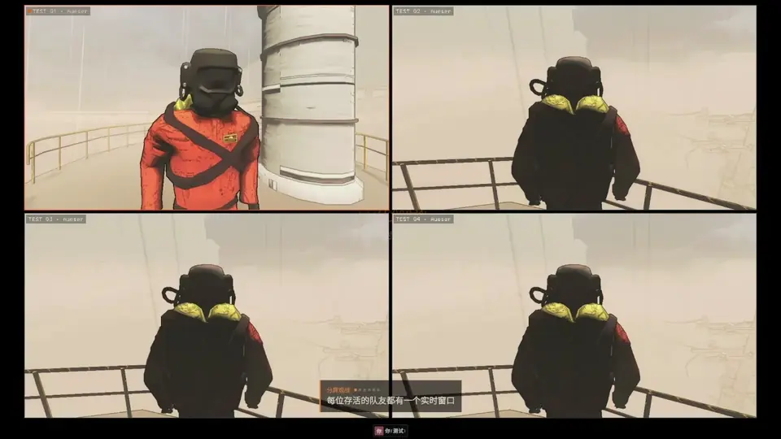</td>
  </tr>
</table>

### 谁在说话

<table>
  <tr>
    <td align="center">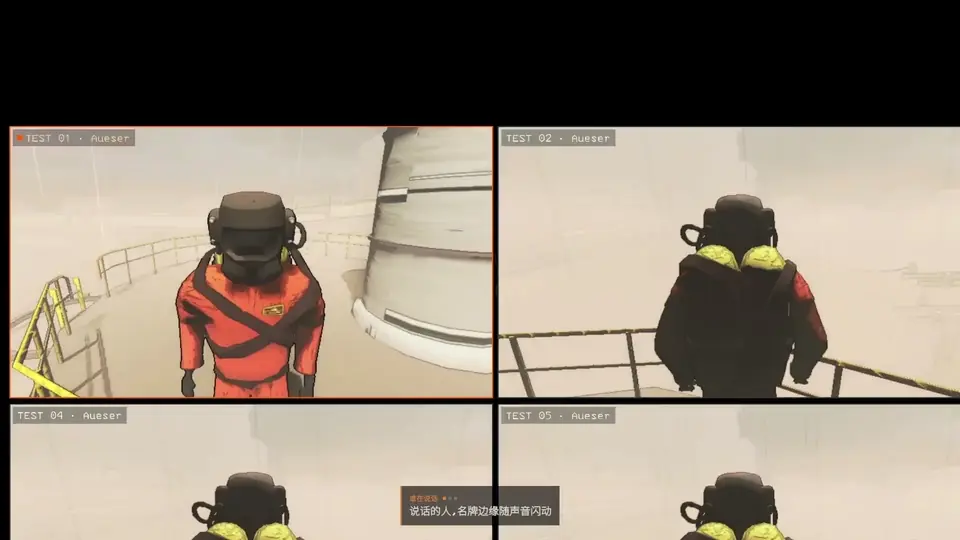</td>
  </tr>
</table>

### 视角与热成像

<table>
  <tr>
    <td align="center">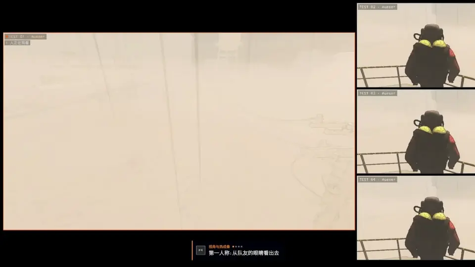</td>
  </tr>
</table>

### 观众席

<table>
  <tr>
    <td align="center">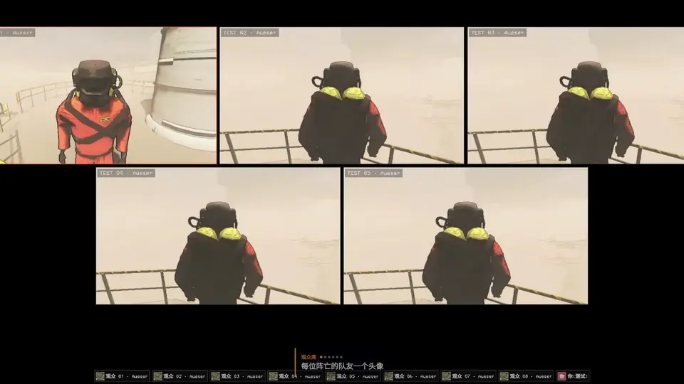</td>
  </tr>
</table>

### 表情

<table>
  <tr>
    <td align="center">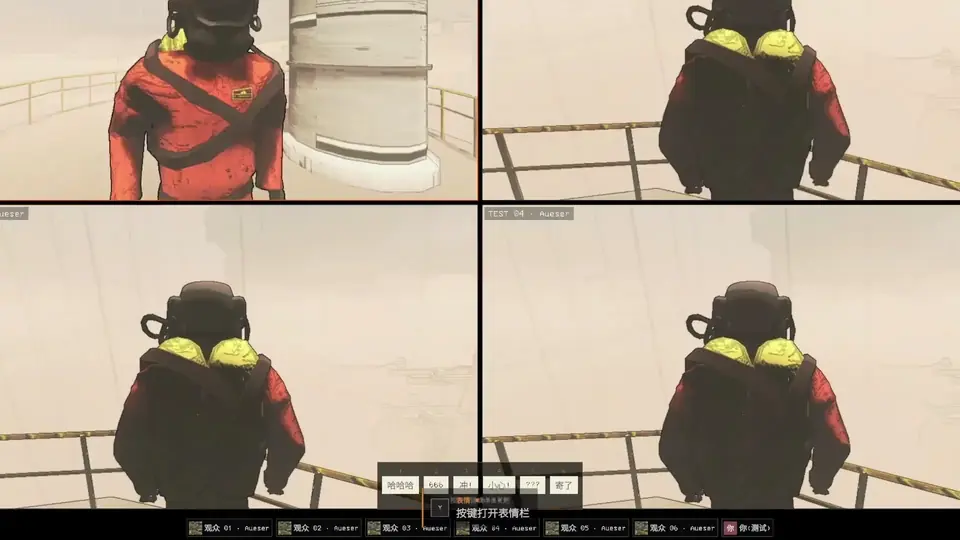</td>
  </tr>
</table>

### 观众竞猜

<table>
  <tr>
    <td align="center">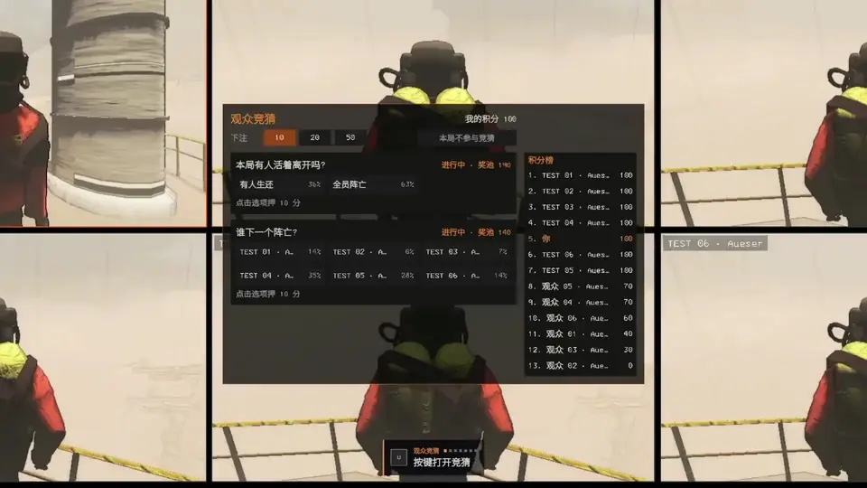</td>
  </tr>
</table>

### 同事评估

<table>
  <tr>
    <td align="center">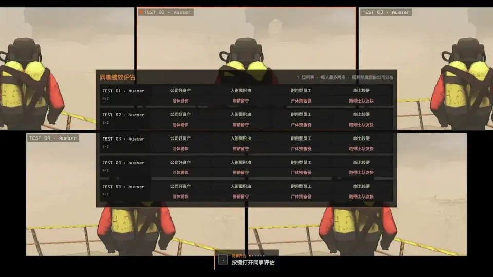</td>
  </tr>
</table>

### 观战视角

<table>
  <tr>
    <td width="50%" align="center">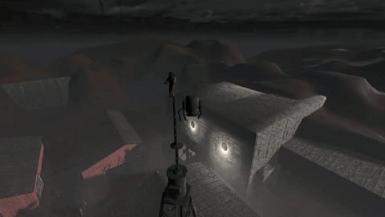 自身第三人称</td>
    <td width="50%" align="center">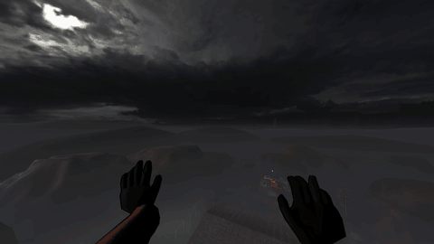 队友第一人称</td>
  </tr>
  <tr>
    <td colspan="2" align="center">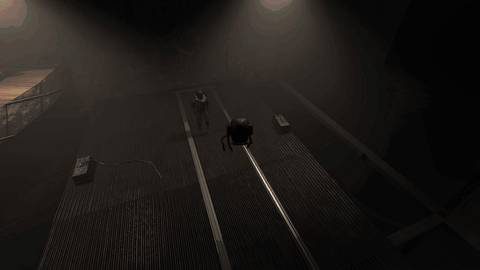 第三人称恐惧模型</td>
  </tr>
</table>

### 运镜模式

<table>
  <tr>
    <td width="33%" align="center">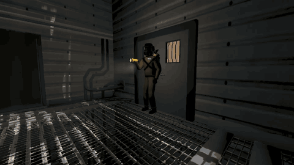 穿梭运镜 · 工厂</td>
    <td width="33%" align="center">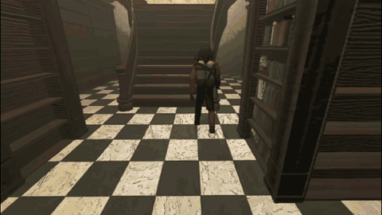 穿梭运镜 · 豪宅</td>
    <td width="33%" align="center">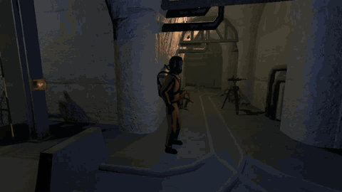 穿梭运镜 · 矿井</td>
  </tr>
  <tr>
    <td width="33%" align="center">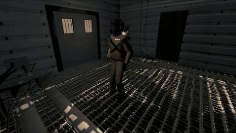 监视器 · 工厂</td>
    <td width="33%" align="center">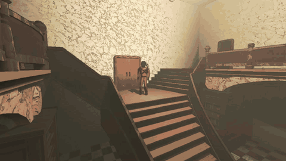 监视器 · 豪宅</td>
    <td width="33%" align="center">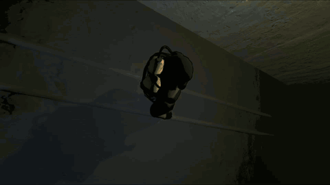 监视器 · 矿井</td>
  </tr>
  <tr>
    <td colspan="3" align="center">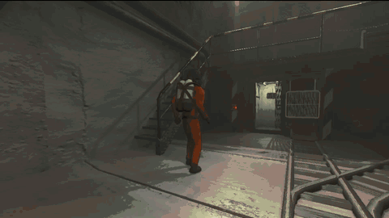 电梯镜头</td>
  </tr>
</table>

### 观战面板

<table>
  <tr>
    <td width="50%" align="center">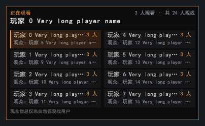 ① 按 O 打开观战面板</td>
    <td width="50%" align="center">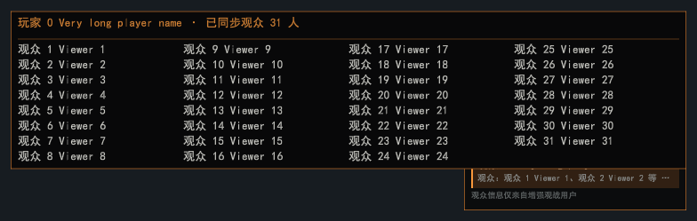 ② 按 P 显示光标，悬停查看完整观众名单</td>
  </tr>
  <tr>
    <td colspan="2" align="center">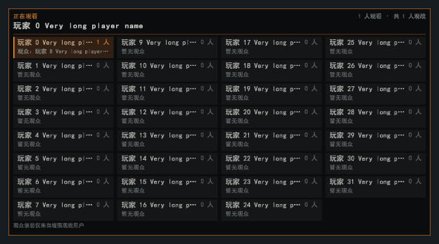 ③ 最多支持 32 人大厅</td>
  </tr>
</table>

### ESC 菜单

<table>
  <tr>
    <td width="50%" align="center">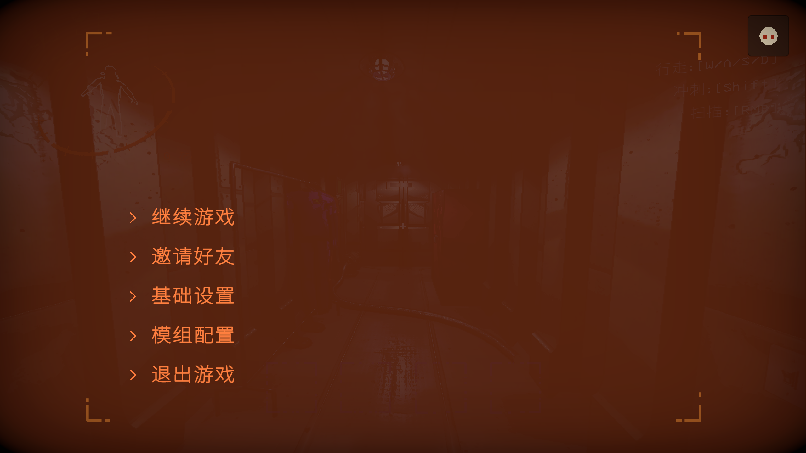 ① ESC 菜单右上角入口</td>
    <td width="50%" align="center">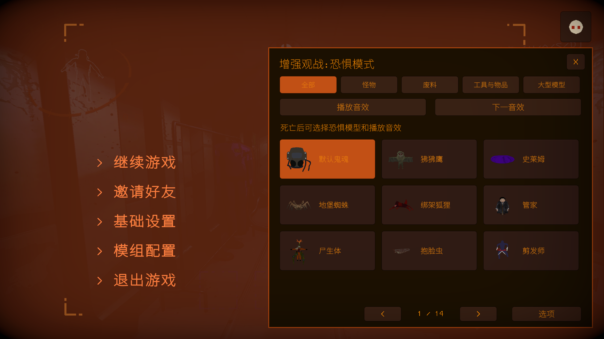 ② 分类选择模型与音效</td>
  </tr>
  <tr>
    <td colspan="2" align="center">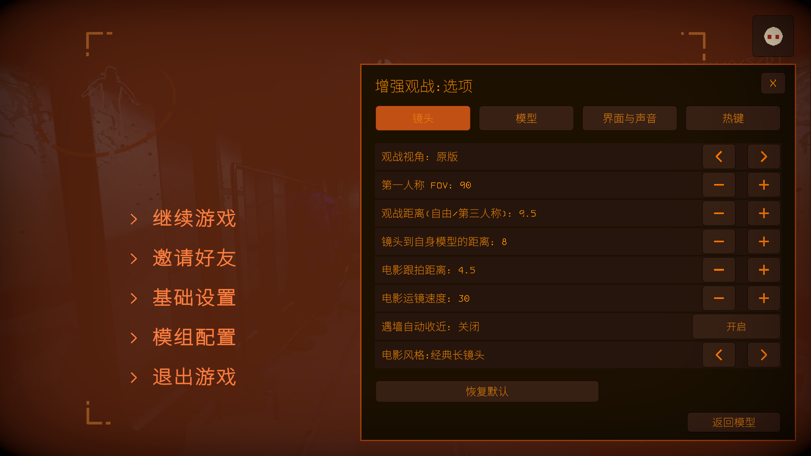 ③ 在选项中调整镜头、模型、声音和热键</td>
  </tr>
</table>

### 默认操作

| 操作 | 按键 |
|:--|:--|
| 自由视角 / 返回原版 | `F6` / `F7` |
| 自身第三人称 / 队友第一人称 / 电影跟拍 | `F3` / `F4` / `F5` |
| 运镜模式 / 热成像 | `F1` / `F9` |
| 移动 / 上升 / 下降 | `W A S D` / `Space` / `Left Ctrl` |
| 加速 / 减速 / 回正位置 | `Left Shift` / `Left Alt` / `R` |
| 观战距离 / 自身镜头距离 | 滚轮 / `Alt＋滚轮` |
| 上一模型 / 下一模型 / 切换运镜风格 | `←` / `→` |
| 播放或停止音效 / 下一音效 | `Z` / `X` |
| 观战分屏 / 分屏时钟 | `B` / `T` |
| 放大窗口、换人或返回平铺；观众席一起观看 | 鼠标左键 |
| 表情 / 观众竞猜 / 同事评估 | `Y` / `U` / `I` |
| 发送表情 | 数字键 `1`–`6` |
| 观战面板 / 光标与镜头切换 | `O` / `P` |
| 显示按键提示 / 隐藏观战界面 | `H` / `F2` |

所有按键都可在 `ESC → Enhanced Spectator → 选项 → 热键` 中修改。

### 安装

通过 **r2modman / Thunderstore Mod Manager** 安装，需要 **BepInExPack 5.4.2100**。手动安装时，将发布包中的 `EnhancedSpectator.dll`、`EnhancedSpectator.CameraRuntime.dll` 及随附许可文件一起放入 `BepInEx/plugins/EnhancedSpectator/`。

配置保存在 `BepInEx/config/Auuueser.EnhancedSpectator.cfg`，高级设置位于同名 `.Advanced.cfg` 文件。

### 兼容

- [LC_Chinese_Project](https://thunderstore.io/c/lethal-company/p/Aueser/LC_Chinese_Project/)：自动切换中文界面与配置，并修复玩家名称。
- [Player_Status_Bars](https://thunderstore.io/c/lethal-company/p/Aueser/Player_Status_Bars/)：状态条在每个分屏窗口中都正对镜头。
- [MoreCompany](https://thunderstore.io/c/lethal-company/p/notnotnotswipez/MoreCompany/)：第一人称观战时隐藏遮挡镜头的装饰。
- [LCBetterClock](https://thunderstore.io/c/lethal-company/p/BlueAmulet/LCBetterClock/)：观战名称避让时钟，起飞时间沿用它的时间格式。
- [NiceChat](https://thunderstore.io/c/lethal-company/p/taffyko/NiceChat/)：观战聊天面板正常使用。
- [SpectatePreviousPlayer](https://thunderstore.io/c/lethal-company/p/kerotein/SpectatePreviousPlayer/)：分屏中右键不再切换窗口。
- [HDLethalCompany](https://thunderstore.io/c/lethal-company/p/Sligili/HDLethalCompany/)：关闭后处理时模型渐显正常。

遇到问题请在 [Issues](https://github.com/Auuueser/Enhanced-Spectator/issues) 附上复现步骤、模组列表及 `BepInEx/LogOutput.log`。项目采用 [GPL-3.0](https://github.com/Auuueser/Enhanced-Spectator/blob/main/LICENSE) 许可。

<strong>English</strong>

### Split-screen spectating

<table>
  <tr>
    <td align="center">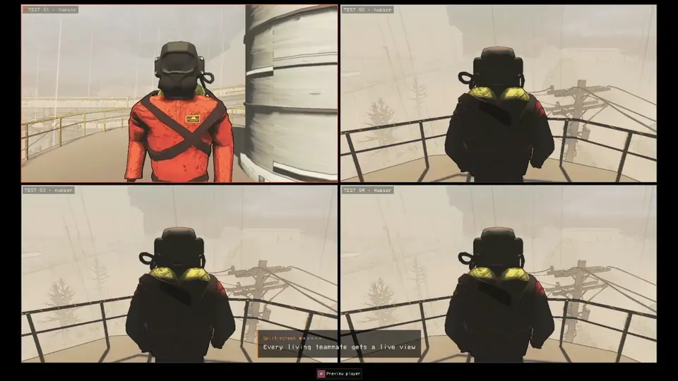</td>
  </tr>
</table>

### Who is speaking

<table>
  <tr>
    <td align="center">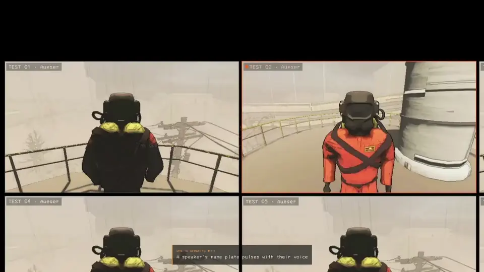</td>
  </tr>
</table>

### Cameras and thermal

<table>
  <tr>
    <td align="center">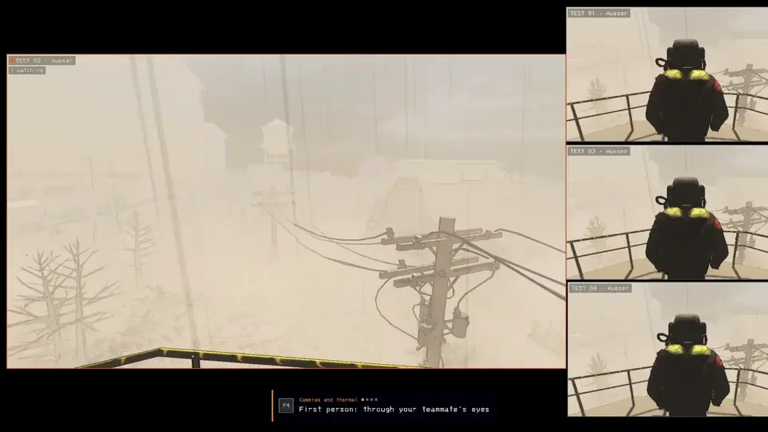</td>
  </tr>
</table>

### Audience row

<table>
  <tr>
    <td align="center">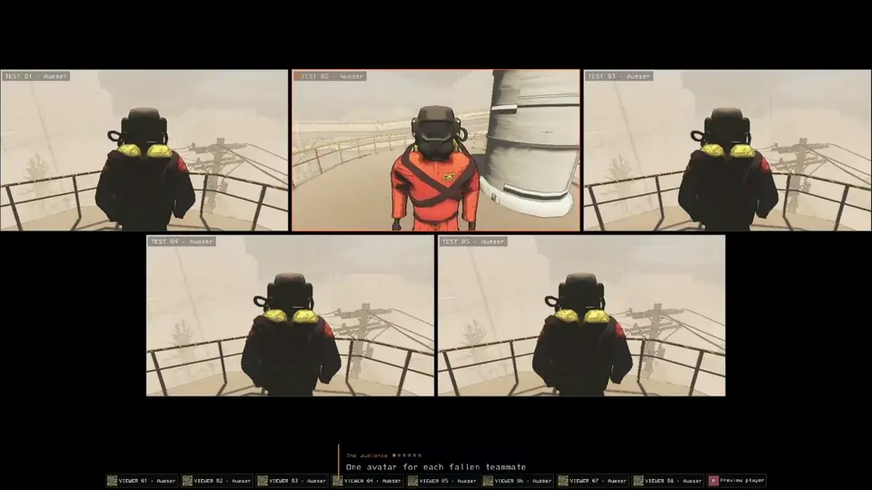</td>
  </tr>
</table>

### Emotes

<table>
  <tr>
    <td align="center">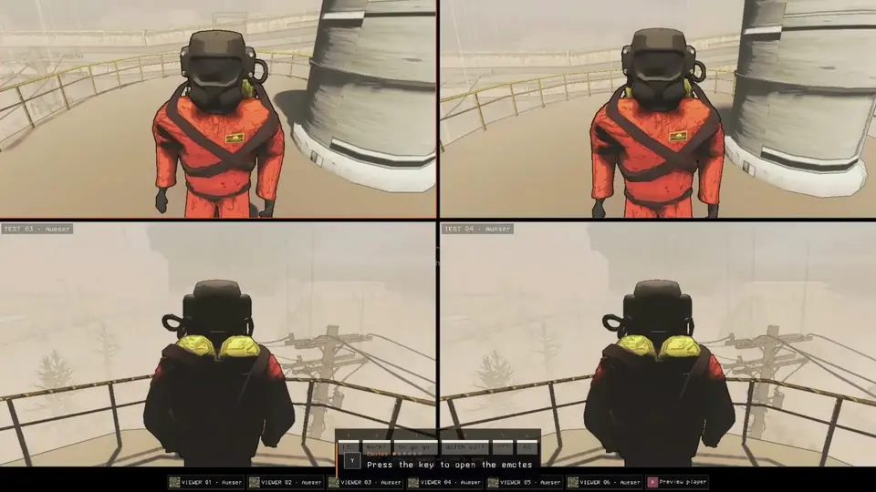</td>
  </tr>
</table>

### Audience bets

<table>
  <tr>
    <td align="center">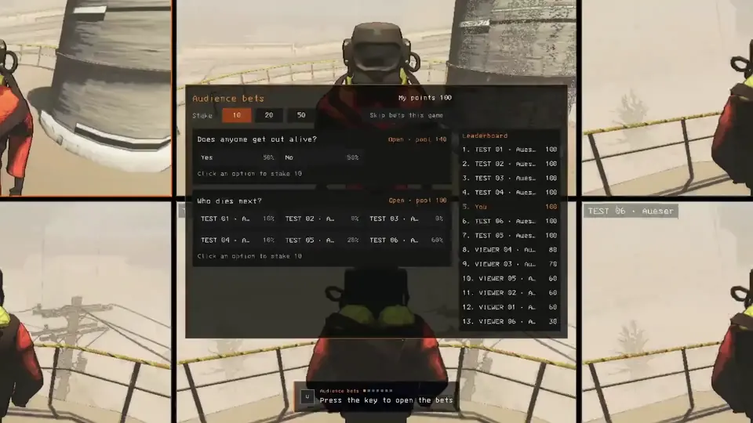</td>
  </tr>
</table>

### Colleague reviews

<table>
  <tr>
    <td align="center">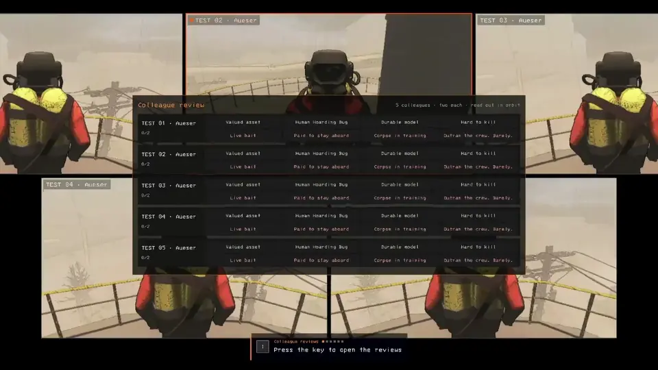</td>
  </tr>
</table>

### Spectator cameras

<table>
  <tr>
    <td width="50%" align="center"> Self third person</td>
    <td width="50%" align="center"> Teammate first person</td>
  </tr>
  <tr>
    <td colspan="2" align="center"> Third-person fear models</td>
  </tr>
</table>

### Camera choreography

<table>
  <tr>
    <td width="33%" align="center"> Travelling · Factory</td>
    <td width="33%" align="center"> Travelling · Mansion</td>
    <td width="33%" align="center"> Travelling · Mineshaft</td>
  </tr>
  <tr>
    <td width="33%" align="center"> Monitor · Factory</td>
    <td width="33%" align="center"> Monitor · Mansion</td>
    <td width="33%" align="center"> Monitor · Mineshaft</td>
  </tr>
  <tr>
    <td colspan="3" align="center"> Elevator shot</td>
  </tr>
</table>

### Watch panel

<table>
  <tr>
    <td width="50%" align="center">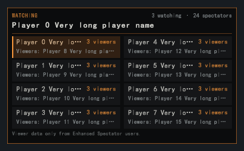 ① Press O to open the watch panel</td>
    <td width="50%" align="center">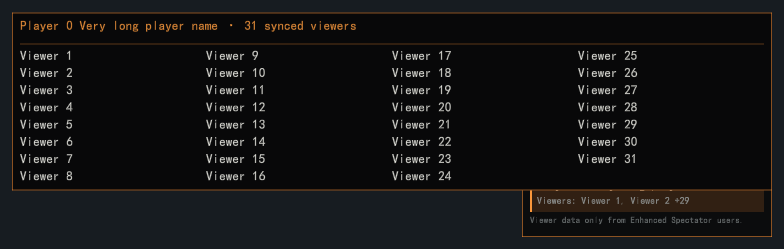 ② Press P for the pointer and hover to see every viewer</td>
  </tr>
  <tr>
    <td colspan="2" align="center">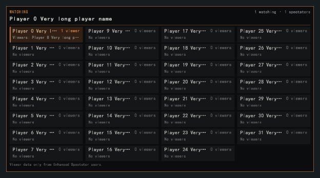 ③ Supports lobbies of up to 32 players</td>
  </tr>
</table>

### ESC menu

<table>
  <tr>
    <td width="50%" align="center">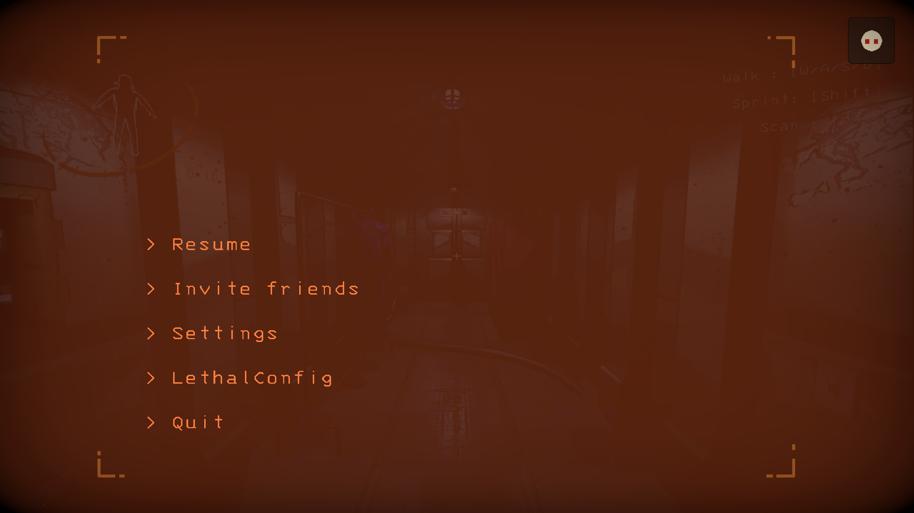 ① Open the top-right ESC menu entry</td>
    <td width="50%" align="center">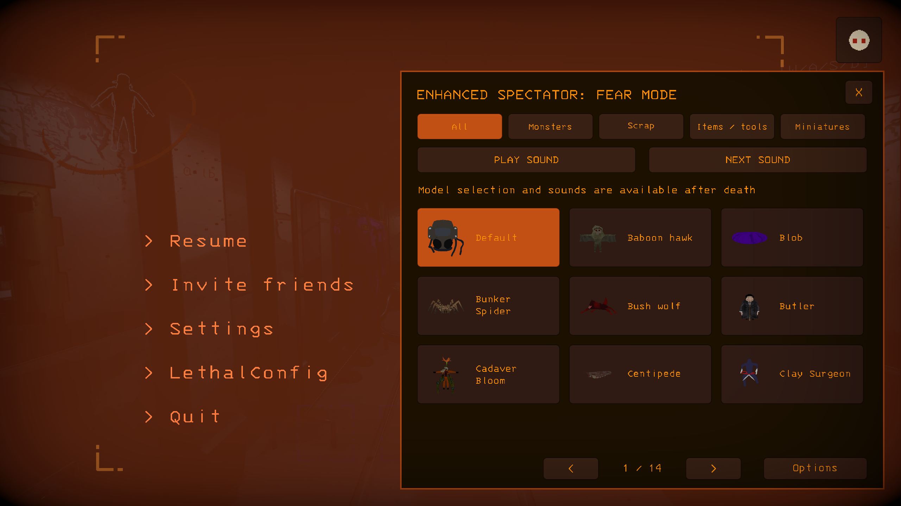 ② Browse models and sounds by category</td>
  </tr>
  <tr>
    <td colspan="2" align="center">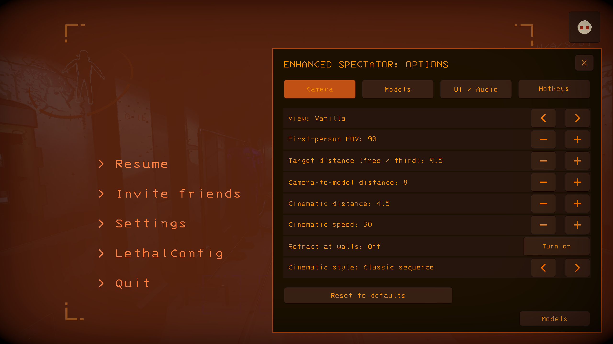 ③ Adjust cameras, models, audio and hotkeys in Options</td>
  </tr>
</table>

### Default controls

| Action | Key |
|:--|:--|
| Freecam / return to vanilla | `F6` / `F7` |
| Self third person / teammate first person / cinematic tracking | `F3` / `F4` / `F5` |
| Camera choreography / thermal imaging | `F1` / `F9` |
| Move / ascend / descend | `W A S D` / `Space` / `Left Ctrl` |
| Fast / slow / recenter | `Left Shift` / `Left Alt` / `R` |
| Spectator distance / self camera distance | Scroll wheel / `Alt + wheel` |
| Previous / next model / switch camera style | `Left` / `Right` |
| Play or stop sound / next sound | `Z` / `X` |
| Split-screen / split-screen clock | `B` / `T` |
| Enlarge a view, change players or return to the grid; watch along from the audience row | Left click |
| Emotes / audience bets / colleague reviews | `Y` / `U` / `I` |
| Send an emote | Number keys `1`–`6` |
| Watch panel / pointer or camera control | `O` / `P` |
| Toggle key hints / hide spectator HUD | `H` / `F2` |

Every key can be changed under `ESC → Enhanced Spectator → Options → Hotkeys`.

### Installation

Install through **r2modman / Thunderstore Mod Manager**. Requires **BepInExPack 5.4.2100**. For a manual install, place `EnhancedSpectator.dll`, `EnhancedSpectator.CameraRuntime.dll` and the bundled license files from the release package in `BepInEx/plugins/EnhancedSpectator/`.

Settings are saved to `BepInEx/config/Auuueser.EnhancedSpectator.cfg`; advanced settings use the matching `.Advanced.cfg` file.

### Compatibility

- [LC_Chinese_Project](https://thunderstore.io/c/lethal-company/p/Aueser/LC_Chinese_Project/): automatically selects Chinese UI and configuration and repairs player names.
- [Player_Status_Bars](https://thunderstore.io/c/lethal-company/p/Aueser/Player_Status_Bars/): status bars face the camera in every split-screen view.
- [MoreCompany](https://thunderstore.io/c/lethal-company/p/notnotnotswipez/MoreCompany/): hides obstructing cosmetics during first-person spectating.
- [LCBetterClock](https://thunderstore.io/c/lethal-company/p/BlueAmulet/LCBetterClock/): keeps the spectator name clear of the clock, and the departure time uses its format.
- [NiceChat](https://thunderstore.io/c/lethal-company/p/taffyko/NiceChat/): works with the spectator chat panel.
- [SpectatePreviousPlayer](https://thunderstore.io/c/lethal-company/p/kerotein/SpectatePreviousPlayer/): right-click no longer switches views in split-screen.
- [HDLethalCompany](https://thunderstore.io/c/lethal-company/p/Sligili/HDLethalCompany/): model fades work with post-processing turned off.

Report problems through [Issues](https://github.com/Auuueser/Enhanced-Spectator/issues), including reproduction steps, your mod list and `BepInEx/LogOutput.log`. Licensed under [GPL-3.0](https://github.com/Auuueser/Enhanced-Spectator/blob/main/LICENSE).

